# #2 Azure IoT Hubセットアップ
この章ではAzureのアクティベーションとAzureIoTHubの作成を行います。

[https://www.microsoftazurepass.com/](https://www.microsoftazurepass.com/)にアクセスし、配布したAzurePassのコードでAzurePassをアクティベーションしてください。

アクティベーション方法は[こちら](https://www.microsoftazurepass.com/Home/HowTo)を御覧ください。

アクティベーションが終わったらAzureのポータル([https://portal.azure.com](https://portal.azure.com))へアクセスします。

アクセスするとこのような画面が表示されます。

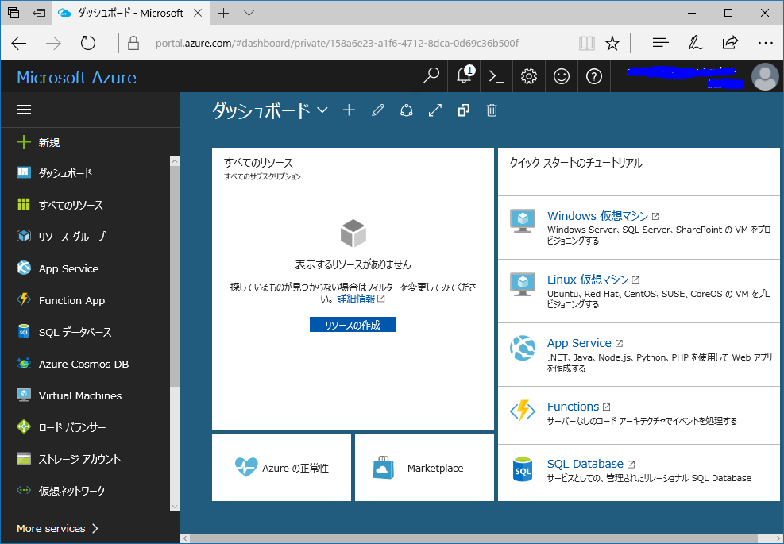

まず、AzurePassが適用されているかを確認します。
ダッシュボードの右下「MoreServices」を選択し、「全般」の中の「サブスクリプション」を選択します。

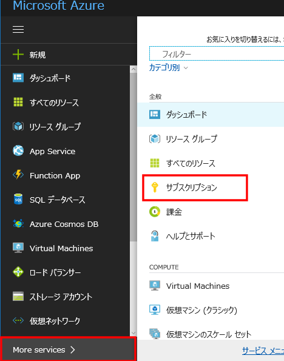

サブスクリプションに「AzurePass」が存在することを確認し、右上の閉じるボタンを押してください。

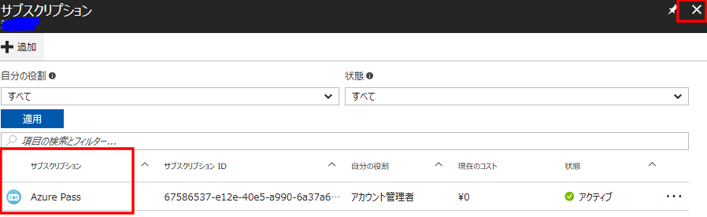

続けてAzureIoTHubの作成を行います。
ダッシュボード左上「新規」を選択し、「モノのインターネット(IoT)」からを「IoTHub」を選択します。

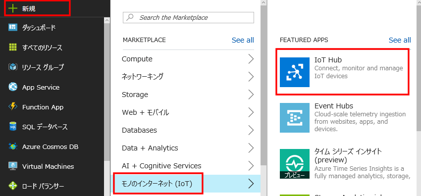

すると名前やスペックを選択する画面が表示されます。

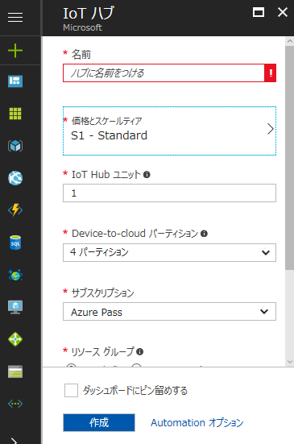

今回は無料プランを利用します。

無料プランの場合8000メッセージ/日 500デバイスまで登録できます([参考](https://azure.microsoft.com/ja-jp/pricing/details/iot-hub/))。

「名前」に任意の名前をつけてください。
>※URLになりますので全世界でユニークなものにしてください。
>すでに利用されている場合は他の名前にしてくださいと表示されます。

「価格とスケールティア」を選択し、「F1 Free」を選択し「選択」ボタンを押します。

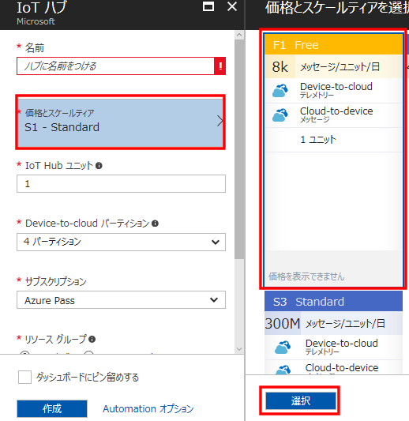

「リソースグループ」は新規作成を選択し、任意の名前をつけてください。

>### リソースグループについて
>リソースグループはAzureの仮想マシン、WebApp、ネットワークなどのリソースをまとめて管理する機能です。
>グループ化することでまとめて消したりすることが出来ます。

「場所」はIoTHubのサーバーが配置される場所なので物理的に近い「東日本」にしてください。
最後に内容を確認し、「ダッシュボードにピン留めする」にチェックを入れ「作成」を押してください。

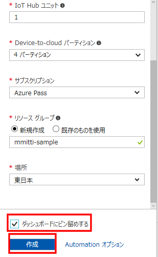

>### ピン留めについて
>ダッシュボードにピン留めをするとトップページにショートカットが作成されます。
>作成したものはMoreServiceからたどることが出来ますが、ダッシュボードにピン留めするとアクセスしやすいのでおすすめです。

IoTHubの作成が終わるとこのようなIoTHubの管理画面に遷移します。

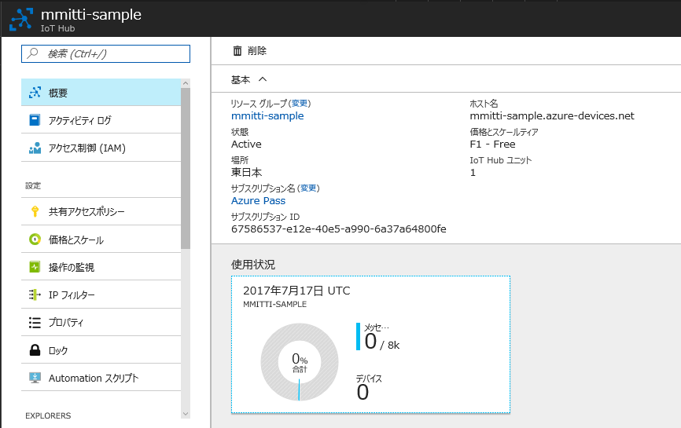

IotHubはWebアプリなど外部サービスがアクセスするようのキーとデバイスがIoTHubに接続するキーが別れていますのでこの2つを取得します。

まず、デバイスから送信されたメッセージを確認したりデバイスにメッセージを送信するためのキーを取得します。

例えばデバイスと連携するWebアプリやデータベースなどで利用します。
今回はデバイスが送信したメッセージを確認するコマンドラインツールで利用します。

「共有アクセスポリシー」を選択し、「iothubowner」を選択します。

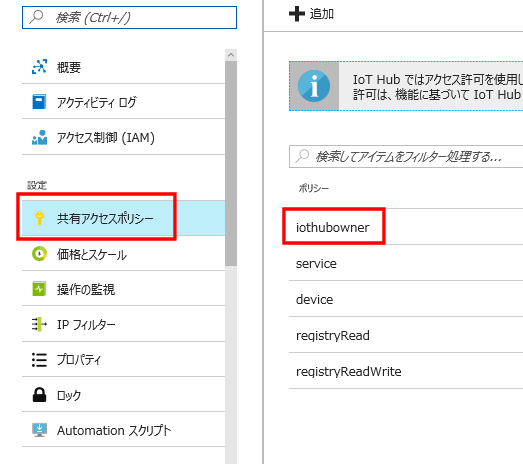

表示される「接続文字列ープライマリーキー」をメモしてください。(こちらはサービス用です)

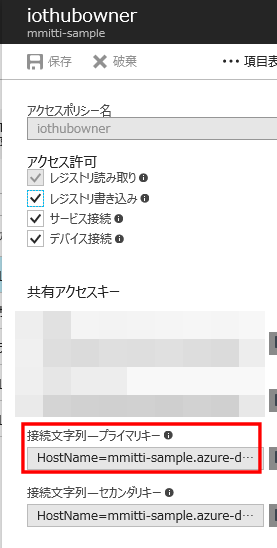

次にデバイスをIoTHubに追加します。

左側のメニューから「EXPLORERS」内の「DeviceExplorer」を選択し、「追加」ボタンを押します。

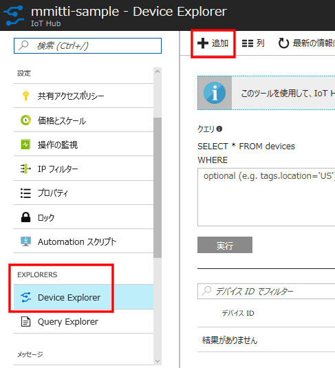

「デバイスID」は任意の名前です。例えばRaspberryPiを複数台接続する場合はそれらを区別できるような名前を入れル必要がありますが、ここではraspiとします。

「キーの自動生成」にチェックが入っていることを確認し「保存」ボタンを押します。

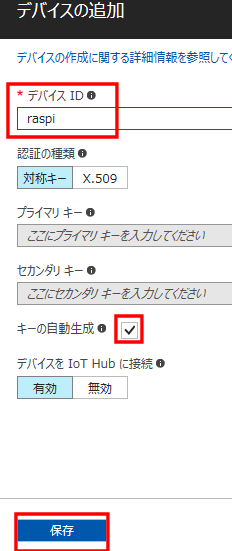

するとこのデバイス用の接続キーが生成されます。

デバイス一覧から先程追加したデバイスを選択し、「接続文字列ープライマリーキー」をメモします。(こちらはデバイス用です)

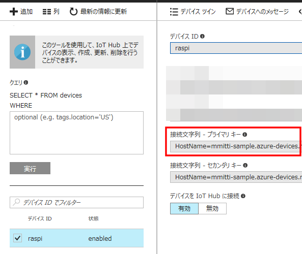

以上でAzureIoTHubの設定は終わりです。

取得した2つの接続キーはあとでつかうのでメモしてください。
