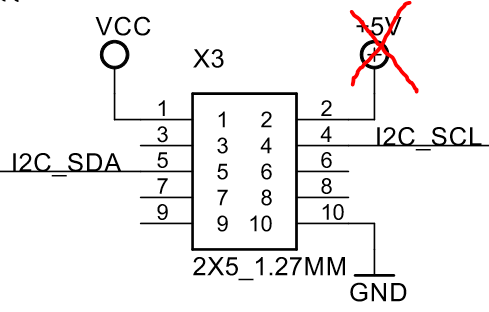
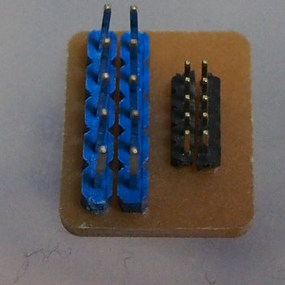
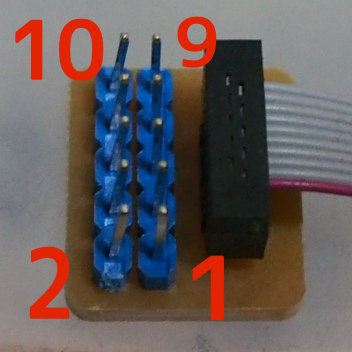
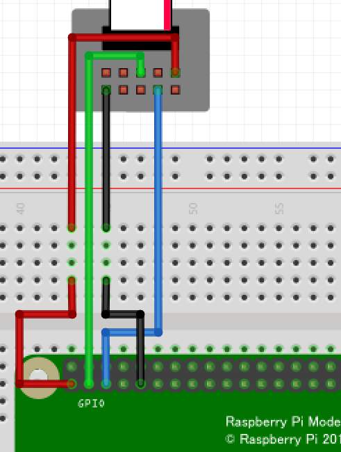
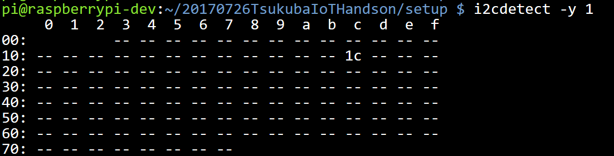
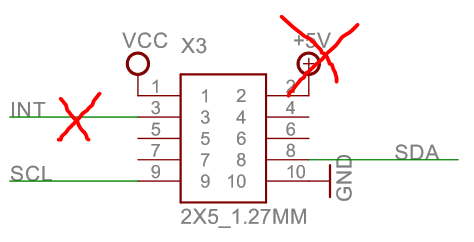
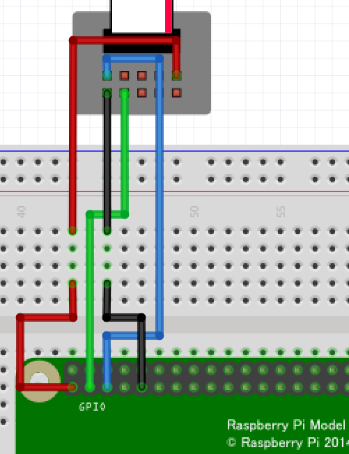

# #4 センサー値をIoT Hubに送信する

この章ではこちらで用意した温湿度センサーを用いて、定期的に温度の計測を行い、クラウド上に送信するプログラムを作成します。

## 温湿度センサーについて
今回はSI70という温湿度センサーが搭載されたセンサーボードを利用します。

[製品ページ](https://www.ghielectronics.com/catalog/product/528)

通常、センサー類などを扱う際はデータシートを読み、電気特性や回路図などを確認する必要がありますが、ここでは必要な情報だけを抜粋して紹介します。

参考：[データシート](https://www.silabs.com/documents/public/data-sheets/Si7020-A20.pdf)

ピン配置は以下のようになっています。



※商品紹介に書いてあるピン配置は嘘です。回路図のほうが正しいみたいです。

また、5Vピンは未使用のため接続しません

画像：https://www.ghielectronics.comより

また、この温湿度センサーはI2Cというバスのプロトコルを用いて通信します。

## I2Cについて
I2C（アイ・スクエアド・シー）はクロック線とデータ線の2本だけを用いて通信する方式です。

親と子に分かれ通信し、親から宛先のアドレス読み書きモードを送信し、書き込みモードの場合は親がデータを送信、読み込みモードの場合は子がデータを送信します。

また、2本の配線を複数の子と共有して接続できるので配線の数が2本で住むというのが大きな特徴です。

センサー類を利用する際は、まずデバイス宛にコマンドを書き込み、次いでセンサーの応答を読み出すという流れが多いです。

## 温湿度センサーのI2Cのレジスタとアドレスについて
データシートより

```
デバイスのアドレス：0x40
温度計測要求コマンド：0xF3
湿度計測要求コマンド：0xF5
```

計測後読み出し要求を送信すると2バイトでセンサー値が帰ってきます（MSB First)

湿度の場合は
```
125*センサー値/65536-6
```
で湿度[%]に、温度の場合は
```
175.72*センサー値/65536-46.85
```
で温度[℃]に変換できます。

ここでは扱いませんが、センサーの感度の設定や内蔵ヒーターの有効化などこれ以外にも様々な命令が用意されています。

## 温湿度センサーの値を読み出す
まずは配線を行います。

RaspberryPI上でI2C通信を行えるピンは限られているので、ピン配置の図を参考に接続します。

I2CのクロックはSCL、I2Cのデータ線はSDAと書かれています。

また、用意したセンサーボードのピンの幅が細いため変換する基盤を利用します。



変換基板にセンサーのケーブルを図のように差し込むと、センサーのピンヘッダーの番号と変換基板のピン番号は以下のように対応します。



以上を踏まえ図のようにセンサーを接続します



pythonでi2c通信を行うにはsmbusライブラリを使います。

```python
#ライブラリ読み込み
import smbus
import time

# I2Cを読み書きするクラスの初期化 (デバイス1で初期化します RaspiはI2Cは1系統だけなので余り意味はありませんが)
bus = smbus.SMBus(1)
# アドレス0x40のデバイス（＝温湿度センサー）にコマンド0xF5(湿度計測要求)を送信
bus.write_byte(0x40, 0xF5)

# 計測が終わるまで少し待つ
time.sleep(0.2)

# アドレス0x40のデバイスから2バイト読み込みを要求する
data0 = bus.read_byte(0x40)
data1 = bus.read_byte(0x40)
# センサー値はMSB LSBの順で送られてくるので16bitのデータに構成し直す
raw_value = (data0 << 8) | data1
# 湿度に変換
humidity = (125 * raw_value / 65536) - 6
print("Humidity:" + str(humidity))

# 温度読み出し要求を送信
bus.write_byte(0x40, 0xF3)

time.sleep(0.2) #計測完了待ち

# 2バイト読み出しとデータの構成
data0 = bus.read_byte(0x40)
data1 = bus.read_byte(0x40)
raw_value = (data0 << 8) | data1

# 温度に変換
temperature = (175.72 * raw_value / 65536) - 46.85
print("Temperature:" + str(temperature))

# i2c終了処理
bus.close()
```

>i2cデバイスが接続されているかを確認するにはアドレススキャンツールを使います
>
>i2cdetect -y 1
>
>実行すると検出された場合はアドレスが、見つからない場合は--が表示されます。
>
>
>
> 認識されていない場合は接触不良の可能性があります。

## [課題]温湿度センサーの値を読み出し、AzureIoTHubに送信する
上記の読み出すサンプルと3章の10秒おきにメッセージを送信するプログラムを参考に作成してみてください。

実際に実装したプログラムはsensors.pyです。
送信するメッセージは文字列であればなんでもOKなので+演算子で文字列を結合するかjsonライブラリを利用してください。

```python
# ライブラリ読み込み
import json
# 送信するデータをきKeyValue形式で作成
data = {"statsu":"OK", "temp":12.3}
# マップからjsonという形式に変換
json_str = json.dumps(status_map)
# 中身は{"statsu":"OK", "temp":12.3}という文字列になります
```

実行後試しに温度センサーを指で抑えると温度が上がると思います。

## [おまけ]加速度センサーを読み出してみる
### 加速度センサーについて

今回用意した加速度センサーMMA8453もI2Cで読み出すことが出来ます。

[製品ページ](https://www.ghielectronics.com/catalog/product/442)

[データシート](http://www.nxp.com/docs/en/data-sheet/MMA8453Q.pdf)

ピンアサインは以下のようになります。



今回も5Vピンは未接続なので未使用です。また、INTは割り込み機能ですが今回は利用しないので未接続です。

この中でセンサーを制御するために必要なデバイスのアドレスとコマンド一覧を示します。
```
アドレス：0x1C
加速度X軸MSB(8bit)：0x01
加速度X軸LSB(2bit)：0x02
加速度Y軸MSB(8bit)：0x03
加速度Y軸LSB(2bit)：0x04
加速度Z軸MSB(8bit)：0x05
加速度Z軸LSB(2bit)：0x06
コントロールレジスタ1：0x2A（後述）
```

加速度の値は8bitモードと10bitモードがありますが、デフォルトの10bitモードを利用することを考えます。

各軸の値のフォーマットは以下のようになっています
```
MSB：VVVV_VVVV
LSB：UU00_0000
V, U:値
```
その為、実際の値にするには
```
MSB << 2 | (LSB >> 6)
```
とすることで
```
RAW=VVVV_VVVV_UU
```
と10bitのセンサー値の生データに変換できます。

また、生データは2の補数表現、デフォルトで計測範囲は+-2gなので
```
if RAW >= 512:
    RAW -=1024
acc = RAW / 512.0 * 2
```

で加速度に変換できます。

また、加速度センサーは起動直後はスタンバイモードになっているので起動する必要があります。

起動の制御にはコントロールレジスタ1に書き込みます。

コントロールレジスタに書き込む値8bitの意味は以下のようになっています

| MSB 7bit | 6bit | 5bit | 4bit | 3bit | 2bit | 1bit | 0bit LSB |
|:-------------:|:-------------:|:-------------:|:-------------:|:-------------:|:-------------:|:-------------:|:-------------:|
|ASLP_RATE1|ASLP_RATE0|DR2|DR1|DR0|LNOISE|F_READ|ACTIVE|

|項目|説明|
|:--:|---|
|ASLP_RATE|センサーがスリープモードのときにどれくらいの間隔で自動起動用に値を取得するか 今回は利用しないのでデフォルト値00を書き込む|
|DR|センサー値のサンプル周期の設定 デフォルト値000=800Hzを書き込む|
|LNOISE|1で低ノイズモード デフォルト0|
|F_READ|1で高速読み込みモード(8bitサンプル) 0で10bitサンプリング デフォルト0|
|ACTIVE|0でスリープモード 1で有効|

その為コントロールレジスタ1に0x01を書き込むことでセンサーが起動します。

### 読み出すサンプル

センサーのピンアサインをもとに以下のように接続します。



```python
import smbus
import time

# センサー値の加速度をg単位に変換する関数
def toAcc(msb, lsb):
    tmp = msb << 2 | (lsb >> 6)
    if tmp >= 512:
        tmp -=1024
    return tmp / 512.0 * 2


# I2Cを読み書きするクラスの初期化 (デバイス1で初期化します RaspiはI2Cは1系統だけなので余り意味はありませんが)
bus = smbus.SMBus(1)
# アドレス0x1Cのデバイス（＝加速度センサー）にコマンド0x2A(コントロールレジスタ1書き込み)とデータ0x01を送信
bus.write_byte_data(0x1C, 0x2A, 0x01)
# 起動するまで少し待つ
time.sleep(0.2)
for i in range(10):
    # 加速度を読み出す
    x_msb = bus.read_byte_data(0x1C, 0x01)
    x_lsb = bus.read_byte_data(0x1C, 0x02)
    y_msb = bus.read_byte_data(0x1C, 0x03)
    y_lsb = bus.read_byte_data(0x1C, 0x04)
    z_msb = bus.read_byte_data(0x1C, 0x05)
    z_lsb = bus.read_byte_data(0x1C, 0x06)

    # 加速度をg単位に変換
    x = toAcc(x_msb, x_lsb)
    y = toAcc(y_msb, y_lsb)
    z = toAcc(z_msb, z_lsb)

    print("X:" + str(x) + " Y" + str(y) + " Z" + str(z))

    time.sleep(1)
# i2c終了処理
bus.close()
```
