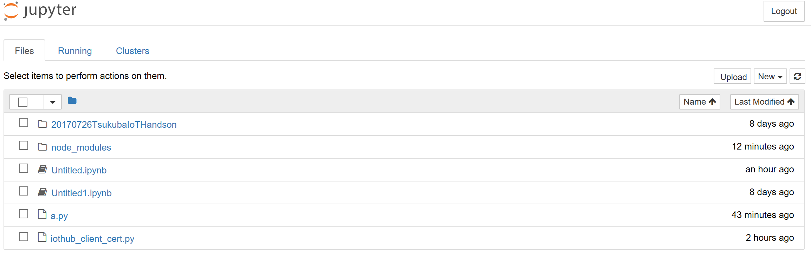
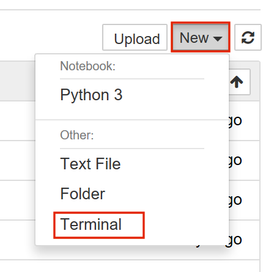
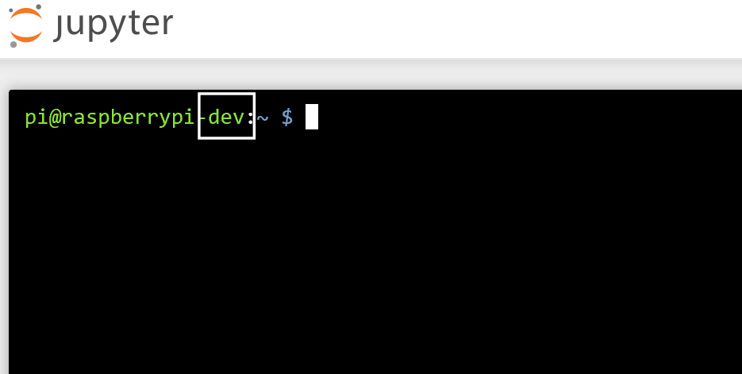
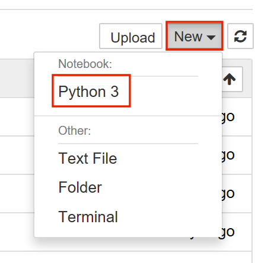
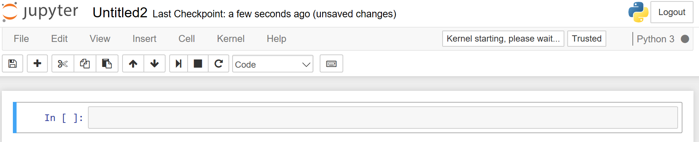
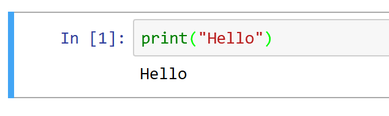

# Jupyter NoteBookについて
今回はWeb経由でPythonのプログラムを作成、実行できるJupyterNotebookという環境を用意しました。

メモ:Firefoxはコンソール画面でコピペがうまく出来ないのでIE, Edge, Chromeでアクセスすることをおすすめします。

配布したIPアドレス:8888にブラウザでアクセスしてください。

Jupyterのトップページが表示されます。


今回はパスワードmspjpで構築してありますのでmspjpでログインしてください。

ログインするとホームフォルダーの中身が表示されます。



まず、接続しているJupyterが手元のRaspberryPiのものであるかを確認するためコンソールを開きます。

## コンソールを開く

右上「New」を選択し「Terminal」を選択します。



するとコンソール画面が開きます。



ここでpi@raspberrypi-番号の番号が配布したカードに書かれている番号と同じであることを確認してください。

また、このコンソールは普通のLinuxのコンソールですので、Linux用のコマンドが動きます。（厳密にはJupyterを動かしている環境のコンソールとなります。）

## NoteBookを作成する
Jupyterはノートブックと呼ばれる形式でコードを作成し実行します。

まずはノートブックを作成しましょう。

右上「New」を選択し「NoteBooks」のなかの「Python3」を選択します。



すると空のノートブックが作成されます。



>ノートブックを開く際はトップ画面から作成したフォルダーを開きノートブック(*.ipynb)を選択すれば開けます。

## コードを書いて実行する
Jupyterのノートブックではセルと呼ばれる単位でコードを書き実行できます。

まずはセルを選択しコードを記載してみます。

```python
print("Hello")
```

続けてCtrl+Enterを押すか実行ボタンを押すことで選択されているセルを実行し出力が表示されます。


再度編集する際はダブルクリックで編集できます。

Jupyterは複数のセルに分割してコードを書いたり出来ますが、今回は1つのセルを使ってコードを書いていきます。

## 強制終了と再起動
コードを実行したあとうまく動かない場合は「Kernel」から「Interupt」を押すことで強制終了できます。
また、「Restart」を押すことでソースコードを実行する処理系が再起動し、「Restart&RunAll」で処理系の再起動後に全セルのソースコードを実行します。

うまく動かなくなった場合は試してみてください。
